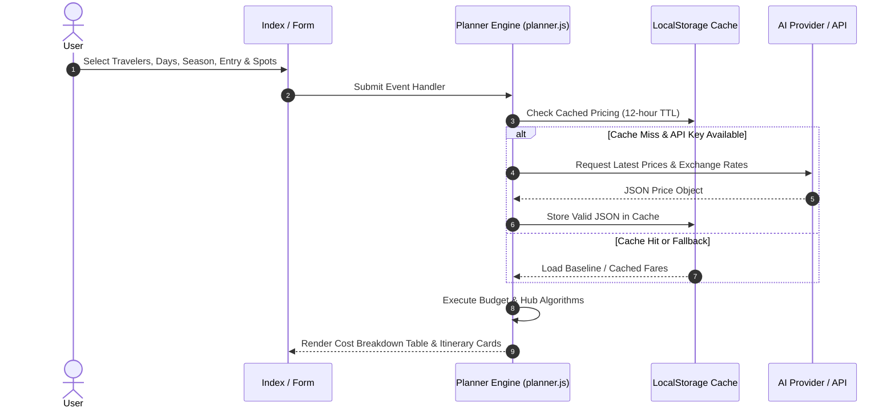

# Architecture & Calculation Engine

This section explains how **Swiss Travel Planner** calculates budget recommendations and structures day-by-day itineraries.

---

## High-Level Data Flow

---

## 1. Hub Selection Logic

Base cities are selected according to geographical hub efficiency:

- **Zermatt + Bernese Oberland**: Split stays between **Interlaken & Zermatt**.
- **Bernese Oberland** (Lauterbrunnen/Grindelwald/Interlaken): Base in **Interlaken** (access to budget hostels & supermarkets).
- **Lucerne**: Base in **Lucerne** (direct connection to Mt. Rigi & Chapel Bridge).
- **Airport Arrival Hubs**:
  - Zurich Airport (ZRH) -> **Lucerne** (45 min train).
  - Geneva Airport (GVA) -> **Lausanne** (30% cheaper lodging).
  - Basel Airport (BSL) -> **Interlaken**.

---

## 2. Transport Pass Optimization Algorithm

The engine selects the most cost-effective pass based on duration and traveler priorities:

$$\text{Short Trips } (\le 4 \text{ Days}): \text{Half Fare Card } (120 \text{ CHF}) + \text{Saver Day Passes}$$

$$\text{Medium Trips } (5\text{--}8 \text{ Days, Budget Focused}): \text{Half Fare Card } (120 \text{ CHF}) + \text{Point-to-Point Tickets}$$

$$\text{Medium Trips } (5\text{--}8 \text{ Days, Convenience Focused}): \text{Swiss Travel Pass } (3, 4, 6, \text{ or } 8 \text{ Consecutive Days})$$

$$\text{Longer Trips } (> 8 \text{ Days}): \text{Half Fare Card } (120 \text{ CHF}) + \text{Regional Pass (Berner Oberland / Tell Pass)}$$

---

## 3. Cost Breakdown Calculations

Total estimated cost ($T_{\text{CHF}}$) is computed as:

$$T_{\text{CHF}} = C_{\text{lodging}} + C_{\text{transport}} + C_{\text{food}} + C_{\text{excursions}}$$

Where:
- $C_{\text{lodging}} = (\text{Rate}_{\text{adult}} \cdot N_{\text{adults}} + \text{Rate}_{\text{child}} \cdot N_{\text{children}}) \times (D - 1)$
- $C_{\text{transport}} = \text{PassCost}_{\text{adult}} \times N_{\text{adults}}$ *(Children 6-15 get free Swiss Family Card)*
- $C_{\text{food}} = (35 \times N_{\text{adults}} + 20 \times N_{\text{children}}) \times D$
- $C_{\text{excursions}} = (\text{Excursion}_{\text{adult}} \cdot N_{\text{adults}} + \text{Excursion}_{\text{child}} \cdot N_{\text{children}})$

Finally converted to USD:

$$T_{\text{USD}} = \text{Math.round}(T_{\text{CHF}} \times \text{Rate}_{\text{chf\_to\_usd}})$$

---

## 4. Cache Expiration & Invalidation

Pricing data is cached in `localStorage`:
- **Cache Key**: `swiss_travel_planner_pricing_cache`
- **Time Key**: `swiss_travel_planner_pricing_cache_time`
- **TTL**: 12 Hours (`12 * 60 * 60 * 1000` ms)

Users can clear the cache at any time via the **AI Settings** modal.
