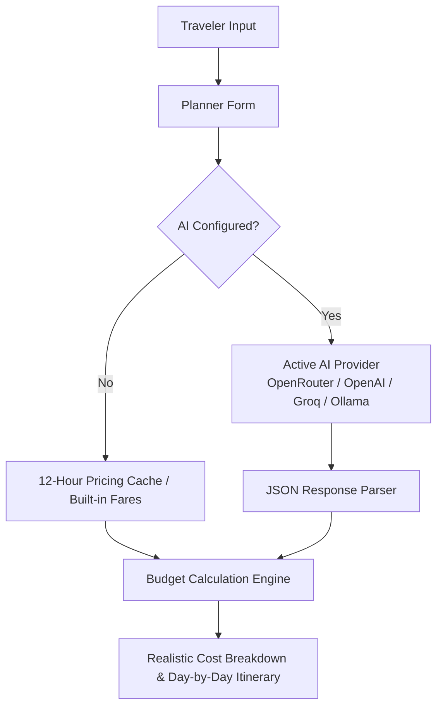

# Swiss Travel Planner & Budget Calculator

Welcome to the official documentation for **Swiss Travel Planner**, an open-source, multi-AI travel calculation and itinerary generation engine.

!!! info "Project Identity & Credits"
    - **Official Website**: [https://planswitzerland.com/](https://planswitzerland.com/)
    - **Project Owner**: [Plan Switzerland](https://planswitzerland.com/)
    - **GitHub Repository**: [https://github.com/swissplanner](https://github.com/swissplanner)
    - **License**: MIT Open Source

---

## What is Swiss Travel Planner?

**Swiss Travel Planner** is a lightweight, high-performance web application created and owned by **[Plan Switzerland](https://planswitzerland.com/)**. It is designed to help budget-conscious travelers estimate their trip costs in Switzerland and generate personalized day-by-day itineraries.

It dynamically calculates transport pass savings (Swiss Travel Pass, Swiss Half Fare Card, Berner Oberland Pass, Tell Pass), mountain excursion fares (Gornergrat, Schilthorn, Mount Rigi, Pilatus, Grindelwald First, Jungfraujoch), budget lodging rates, daily food expenses, and live CHF to USD exchange rates.

---

## Key Features

- 💳 **Realistic Cost Calculations**: Accurately computes transport passes, hostel/hotel rates, meals, and mountain excursions.
- 🤖 **Multi-AI Engine**: Connects to **OpenRouter, OpenAI, Groq, MiniMax, Ollama (Local AI)**, or any OpenAI-compatible API.
- ⚡ **Local Caching & Fallback**: Stores live fare data in `localStorage` for 12 hours. Operates 100% offline using built-in database when no API key is set.
- ⚙️ **Centralized Configuration**: All site branding, base fares, and AI presets are managed cleanly via `config.js`.
- 🔐 **Dual Security Modes**: Choose between client-side API keys via browser modal or server-side proxy (`/api/chat`).
- 🎨 **Modern Design System**: Built with Tailwind CSS, Lucide icons, Google Fonts (`Plus Jakarta Sans`, `JetBrains Mono`), and glassmorphism elements.

---

## Credits & Ownership

This project is created and actively maintained by **[Plan Switzerland](https://planswitzerland.com/)**, your ultimate guide for authentic, family-friendly, and budget-conscious travel in Switzerland.

- Website: [https://planswitzerland.com/](https://planswitzerland.com/)
- GitHub: [https://github.com/swissplanner](https://github.com/swissplanner)

---

## Documentation Contents

- **[Quick Start](quickstart.md)**: Get up and running in under 2 minutes.
- **[Configuration](configuration.md)**: Customize branding, default fares, and AI options via `config.js`.
- **[AI Providers Integration](ai-providers.md)**: Setup OpenRouter, OpenAI, Groq, MiniMax, Ollama, or Custom APIs.
- **[Architecture & Engine](architecture.md)**: Deep dive into the calculation logic and cache mechanisms.
- **[Deployment & Hosting](deployment.md)**: Deploy to Vercel, Netlify, Cloudflare Pages, Docker, or VPS.
- **[API Reference](api-reference.md)**: Endpoint documentation and JSON schema specifications.
